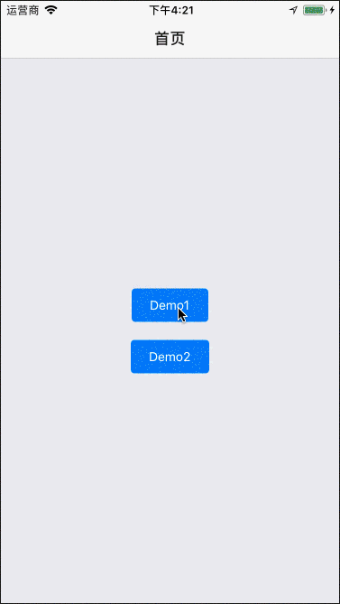
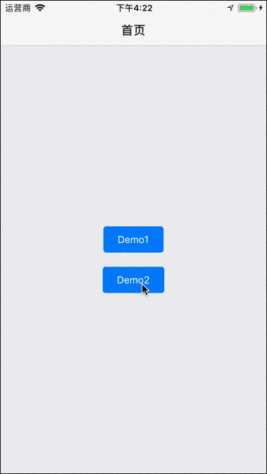

## MagicMoving

A novel transition animation between components. 

## 1. Examples

Download the repository, cd the examples directory, and run it on simulator.

```bash
git clone git@github.com:SmallStoneSK/react-native-magic-moving.git
cd examples
react-native run-ios      # for ios
react-native run-android  # for android
```

<p align="center">
  
  
</p>

## 2. Basic Usage

At first, you should install react-native-magic-moving. Like this:

```bash
npm install react-native-magic-moving --save
```

Then, you can refer to the following example. At least, you should pass 4 properties to MagicMoving:

1. data: the dataSource for rendered list.
2. cardStyle: it will work on the list's card container.
3. renderCardContent: custom what you want to show in the card.
4. renderPopupLayerContent: custom what you want to show in the popup layer.

**Note: each item in the data should have a image. Because it is the image source of popup layer banner image.**

```javascript
import React from 'react';
import {Text, Image, StyleSheet} from 'react-native';
import {MagicMoving} from 'react-native-magic-moving';

const mockedData = [
  {
    image: {uri: 'https://hellorfimg.zcool.cn/preview260/525525049.jpg'},
    content: 'card 0'
  },
  {
    image: {uri: 'https://hellorfimg.zcool.cn/preview260/267756197.jpg'},
    content: 'card 1'
  },
  {
    image: {uri: 'https://hellorfimg.zcool.cn/preview260/409679020.jpg'},
    content: 'card 2'
  },
  {
    image: {uri: 'https://hellorfimg.zcool.cn/preview260/682966966.jpg'},
    content: 'card 3'
  }
];

export class Demo extends React.Component {

  _renderCardContent = (item, index) => {
    return <Image style={styles.cardImage} source={item.image}/>;
  };

  _renderPopupLayerContent = (item, index) => {
    return <Text>{item.content}</Text>;
  };

  render() {
    return (
      <MagicMoving
        data={mockedData}
        cardStyle={styles.cardContainer}
        renderCardContent={this._renderCardContent}
        renderPopupLayerContent={this._renderPopupLayerContent}
      />
    );
  }
}

const styles = StyleSheet.create({
  cardContainer: {
    marginTop: 20,
    marginHorizontal: 20
  },
  cardImage: {
    width: 335,
    height: 200
  }
});
```

In the example above, the content of popup layer is ready before it shows. If you want to read it asynchronously from the network, you can see the demo2 (click [here](https://github.com/SmallStoneSK/react-native-magic-moving/blob/master/examples/src/pages/Demo2/index.js)).

In fact, you can do much things as MagicMoving offers 3 methods for you: onPopupLayerWillShow, onPopupLayerDidShow, onPopupLayerDidHide.

## 3. Properties

|Prop|Default|Type|Description|
|:----|:-------|:----|:-----------|
|style|-|object|allow custom list|
|cardStyle|-|object|allow custom list card|
|data|[]|array|data source of list|
|openDuration|300|number|duration of showing popup layer animation|
|closeDuration|300|number|duration of closing popup layer animation|
|renderCardContent|-|function|complete control how to render the content of list card|
|renderPopupLayerContent|-|function|complete control how to render the content of popup layer|
|renderPopupLayerBanner|-|function|you can custom the popup layer's banner using this function with params(bannerImageStyle)|
|onPopupLayerWillShow|-|function|be called before popup layer showing|
|onPopupLayerDidShow|-|function|be called after popup layer has shown|
|onPopupLayerDidHide|-|function|be called after popup layer has hidden|